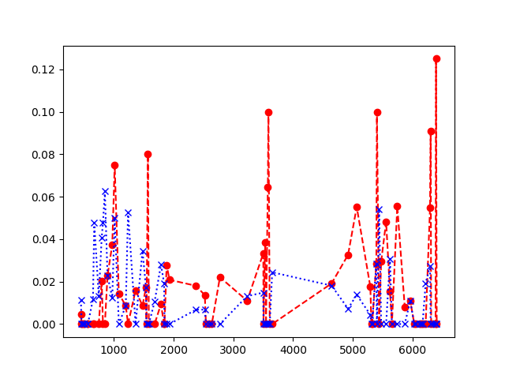

# Overview
走れメロスをネガポジ分析してみたもの

- x軸が物語の進行度（単語数から算出)
- y軸がネガポジ度（赤がポジ、青がネガ)



結果から、前半めっちゃ怒ってて後半はそこそこポジティブなのがわかる。

## Usage

```python
$ python3 display_meros_emotion_by_timeline.py
```

## Other
iterm2で利用する場合、ターミナル場でプロットするライブラリを入れること

[itermplot](https://github.com/daleroberts/itermplot)

plotのバックエンドにitermplotを利用する

```bash 
$ export MPLBACKEND="module://itermplot"
```

